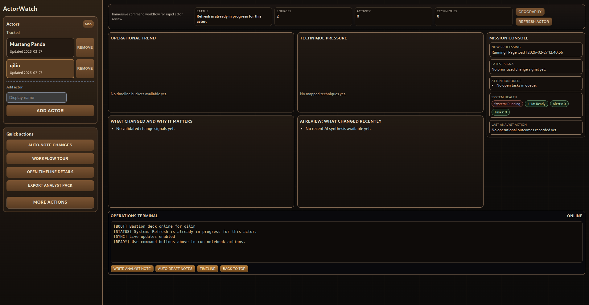

# ActorWatch

A lightweight threat actor lookup tool that turns reporting into a clear
starting point for defensive review.




------------------------------------------------------------------------

## Overview

ActorWatch is a small web application that helps you:

-   Look up a known threat actor
-   See a concise summary of who they are
-   Review recent reporting highlights
-   Get a short list of practical defensive checks to start with

It is intended to provide an at-a-glance reference, not a full CTI
platform.

------------------------------------------------------------------------

## Architecture

See `docs/architecture.md` for the contributor map:

- request/route modules
- service layer responsibilities
- pipeline responsibilities
- database ownership and refresh flow

This is the best starting point for community contributors.

For operator onboarding, screen guidance, and common admin workflows, see:

- `docs/community_guide.md`
- `CONTRIBUTING.md`
- `SECURITY.md`

------------------------------------------------------------------------

## Requirements

Before starting, ensure you have:

-   A computer running Windows, macOS, or Linux
-   **Docker Desktop** installed and running\
    https://www.docker.com/products/docker-desktop
-   Internet access on first run so Docker can pull base images

No external gateway or Codex-specific network setup is required.

To verify Docker is installed:

    docker --version

If a version number appears, Docker is ready.

------------------------------------------------------------------------

## Setup Instructions

### 1. Clone the Repository

Using Git:

    git clone https://github.com/grimmsgadgets-cmyk/ActorWatch.git
    cd ActorWatch

Or download the ZIP from GitHub and open a terminal inside the extracted
folder.

------------------------------------------------------------------------

### 2. Build and Start the Application

From inside the project folder:

    docker compose up --build

This will:

-   Build the Docker image
-   Install dependencies inside the container
-   Start the web application and local Ollama service
-   Pull the configured Ollama model (`llama3.1:8b` by default) before app startup

The first run may take a few minutes.
If the model is not already present, first run can take longer while the model downloads.

To override model selection (for lower-resource machines), set `OLLAMA_MODEL` before running compose.
Example:

    OLLAMA_MODEL=llama3.1:8b docker compose up --build

Security defaults:

-   The app is published on `127.0.0.1:8000` (local machine only)
-   Reverse-proxy headers are not trusted by default (`TRUST_PROXY_HEADERS=0`)
-   Outbound URL fetches use a built-in domain allowlist unless you set
    `OUTBOUND_ALLOWED_DOMAINS`
-   Outbound URL fetches require HTTPS by default (`ALLOW_HTTP_OUTBOUND=0`)
-   Cross-site browser write requests are blocked (Origin/Referer validation)
-   Community Edition is local-first and should not be internet-exposed without external access controls

------------------------------------------------------------------------

### 3. Access the Application

Once the container is running, open your browser and go to:

    http://localhost:8000

If that does not load, check the terminal output for the correct port
number.

------------------------------------------------------------------------

## Community Ops (Quick)

Useful endpoints:

- `GET /health`
- `GET /actors`
- `POST /actors`
- `GET /actors/{actor_id}/hunts/iocs`
- `POST /actors/{target_actor_id}/merge` (form or JSON with `source_actor_id`)
- `GET /actors/{actor_id}/refresh/stats`
- `GET /actors/{actor_id}/evidence/ranked`
- `GET /actors/{actor_id}/stix/export`
- `POST /actors/{actor_id}/stix/import`
- `POST /actors/{actor_id}/taxii/sync` (optional local/manual sync; requires collection URL)
- `GET /actors/{actor_id}/taxii/runs`
- `POST /actors/{actor_id}/feedback`
- `GET /actors/{actor_id}/feedback/summary`

------------------------------------------------------------------------

## Interface Modes

Use the **Interface mode** dropdown in the top-right of the main screen.

- `Classic`: standard community layout.
- `Redraw`: green-tint operations layout.
- `Bastion`: immersive command-deck layout (same data/workflows, different presentation).

Notes:

- These are built-in UI modes; no separate login/auth mode is required.
- Mode choice is stored in browser local storage and reused on reload.

### Bastion Control Layout

In `Bastion` mode:

- Top command bar keeps high-frequency actions:
  - `Geography`
  - `Refresh actor`
  - `← Classic` to exit back to Classic mode
- Command terminal (bottom of main panel) accepts typed commands:
  - `help` — show available commands
  - `refresh` — trigger actor refresh
  - `note <text>` — open analyst note dialog
  - `timeline` — open timeline details
  - `map` — open geography map
  - `status` — read health and source count to log
  - `clear` — clear terminal log
- Keyboard shortcuts (when not in an input field):
  - `R` — refresh actor
  - `N` — open analyst note dialog
  - `T` — open timeline details
  - `G` — open geography map
- Right-side `Ops console` shows:
  - `Status` — notebook health
  - `Sources` — ingested source count
  - `Activity` — recent activity highlight
  - `Techniques` — top MITRE ATT&CK technique
- Right-side data panels:
  - `Operational trend` — bar chart of activity over time
  - `Top techniques` — ranked MITRE ATT&CK techniques with usage bars
  - `Change signals` — what changed and why it matters
  - `Synthesis` — AI-reviewed activity summary
  - `Open questions` — data-driven analyst nudges (no AI; derived from gaps in record)

------------------------------------------------------------------------

## Actor Geography Map

Click the **Geography** button (available in all modes) to open the map overlay.

- **Dark tile layer** — CartoDB Dark Matter, matching the app's dark aesthetic
- **Clustering** — when multiple actors share the same mapped location, a single
  cluster dot is shown with the actor count. Click the cluster to list those actors
  in the sidebar, then select one to view details.
- **Status-based dot colors**:
  - Red — Active (`ready` or `running` notebook state)
  - Amber — Quiet (`warning` notebook state)
  - Grey — Dormant (`idle`, `error`, or no notebook yet)
- Click any map location to filter the sidebar by country (or continent if
  country lookup is unavailable). Click an actor in the list to view details
  and track them from the map.

------------------------------------------------------------------------

Auto-refresh defaults:

- `AUTO_REFRESH_ENABLED=1`
- `AUTO_REFRESH_MIN_INTERVAL_HOURS=6`
- `AUTO_REFRESH_LOOP_SECONDS=300`
- `AUTO_REFRESH_BATCH_SIZE=8`
- `AUTO_MERGE_DUPLICATE_ACTORS=1`

------------------------------------------------------------------------

## Feed Categories

Feed definitions are grouped in `app.py` under `FEED_CATALOG`:

- `ioc`: IOC-bearing threat intel sources (best candidates for IOC extraction/hunt query generation)
- `research`: broader threat-research sources
- `advisory`: vendor/government advisory feeds
- `context`: context/news sources (useful for awareness, not primary IOC extraction)

Derived runtime lists:

- `PRIMARY_CTI_FEEDS` = `ioc + research`
- `EXPANDED_PRIMARY_ADVISORY_FEEDS` = `advisory`
- `SECONDARY_CONTEXT_FEEDS` = `context`
- `DEFAULT_CTI_FEEDS` = all of the above

If you want to target IOC-only ingestion, start from `IOC_INTELLIGENCE_FEEDS`.

------------------------------------------------------------------------

## Analyst Note-Taking (Best Practices)

Quick checks are for immediate hunting actions. Notes are separate.

In the main notebook workflow, use **Analyst notes and history**:

- Tabs:
  - `Capture` for writing/saving notes
  - `Since review` for baseline counters
  - `Best practices` for note quality guidance
  - `Advanced` for history, tasks/outcomes, alerts, and coverage views

When adding analyst notes:

- Use `observation -> evidence -> action`
- Observation: include specific host/user/IOC/time scope
- Evidence: include one source URL or log reference
- Action: choose one clear next state (`contain`, `monitor`, `escalate`, `close`)
- Keep notes short and avoid assumptions without evidence

Example:

`Observation: 3 hosts queried bad.example in last 24h.`
`Evidence: DNS log query + https://source.example/report.`
`Action: contain affected hosts and escalate to IR.`

------------------------------------------------------------------------

## Stopping the Application

Press:

    CTRL + C

Then optionally clean up containers:

    docker compose down

------------------------------------------------------------------------

## Backup and Restore

The SQLite database lives in Docker volume `actortracker_db`.

Backup:

```bash
docker run --rm -v actortracker_actortracker_db:/from -v "$PWD":/to alpine \
  sh -c "cp /from/app.db /to/app.db.backup"
```

Restore:

```bash
docker run --rm -v actortracker_actortracker_db:/to -v "$PWD":/from alpine \
  sh -c "cp /from/app.db.backup /to/app.db"
```

## Minimal Troubleshooting Checklist

If something does not work, check the following:

-   **Docker running?**\
    Ensure Docker Desktop is open and running.

-   **Port already in use?**\
    If you see a port error, another application may be using port 8000.

-   **Changes not appearing?**\
    Rebuild the container: docker compose down docker compose up --build

-   **Build failed?**\
    Scroll up in the terminal to read the exact error message.

------------------------------------------------------------------------

## Project Status

Early-stage and evolving.\
Expect iterative improvements and UI changes.

## Community Edition Ops

See:

- `docs/community_edition_ops.md`
- `docs/maintainer_setup.md`
- `SECURITY.md`
- `scripts/migrate_sqlite.sh`
- `scripts/community_smoke.sh`
- `scripts/prune_data.sh`
- `docs/samples/stix_bundle_minimal.json`

## Release and Dependency Maintenance

- Configure trust guardrails once: `docs/maintainer_setup.md`
- Dependabot config: `.github/dependabot.yml`
- Version bump helper: `scripts/bump_version.sh`
- Release workflow (tag + validation): `.github/workflows/release.yml`

## Learning Features (Community)

- Analyst feedback loop:
  - Submit feedback for `priority_question` and `hunt_query` items.
  - Feedback contributes to ranking and usefulness scoring.
- Environment-aware IOC hunts:
  - Per-actor environment profile (query dialect + field mapping + default time window).
  - Hunt queries are personalized before display.
  - Primary hunt sections are distinct by telemetry system:
    - `DNS/Proxy/Web`
    - `Network`
    - `Endpoint/EDR`
    - `Identity`
  - Hunt tabs include:
    - `Generic (Vendor-neutral)` (default)
    - `Sentinel KQL`
    - `Splunk SPL`
    - `Elastic KQL/ES|QL`
- Source reliability auto-tuning:
  - Hunt feedback updates per-domain reliability.

## Quick Checks and Evidence Dates

- Quick Checks use actor-scoped evidence in a rolling 30-day window.
- Evidence date fallback uses effective source date:
  - `published_at`
  - else `ingested_at`
  - else `retrieved_at`
- When `published_at` is blank and `ingested_at` is used, evidence lines are labeled with `(ingested)`.

## Cold Actor Backfill

- If an actor has no recent evidence in the last 30 days, cold backfill can run to ingest recent actor-linked reporting.
- Newly ingested sources are then used by normal notebook and Quick Checks generation.

## Fresh Install Behavior

- A fresh install starts with no tracked actors.
- Add and track actors from the UI (`/`) or API (`POST /actors`).
  - Reliability adjusts source confidence weighting used in notebook views.
